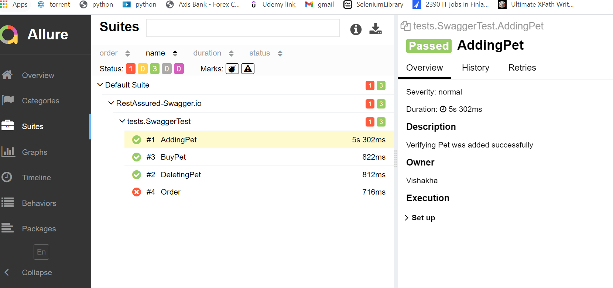
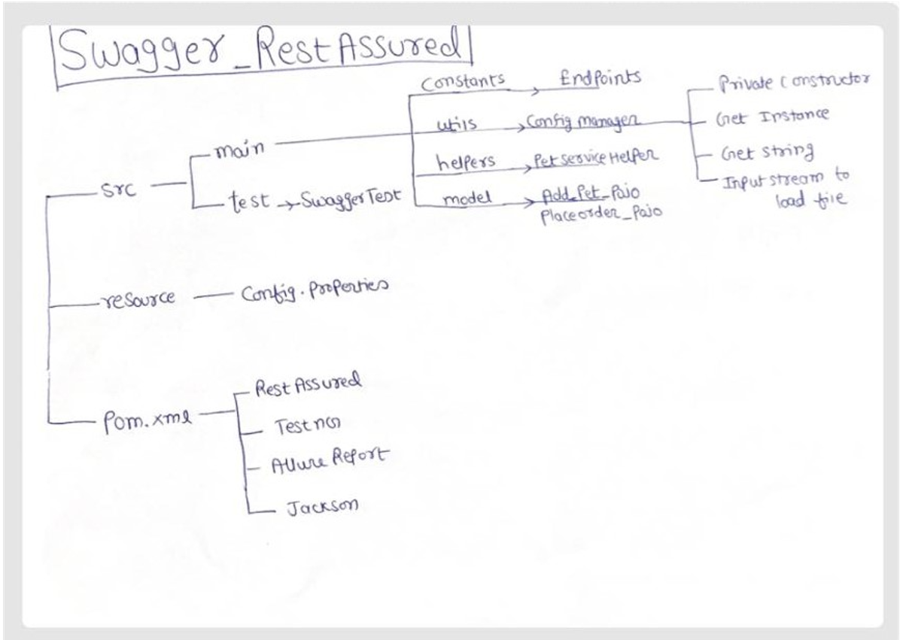
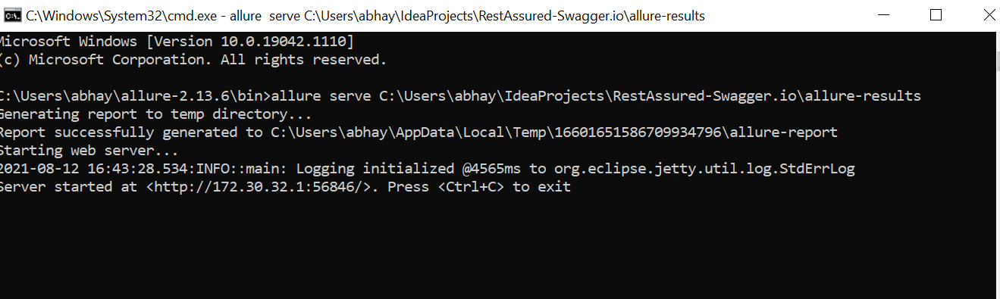

Allure Report for the Test cases
First three was working and fourth was failed intentionally to generate failure report.

This is the folder structure for the Rest Assured Framework

To generate the allure report run this command from allure bin folder

